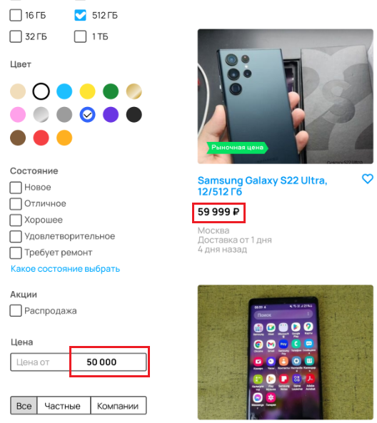
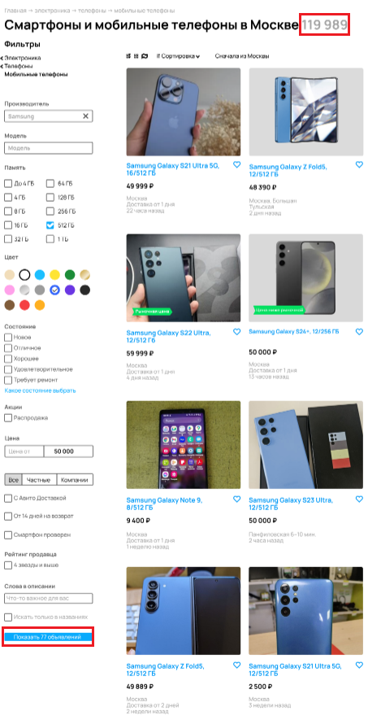
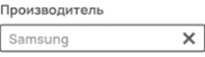

# Задание 1
Необходимо по представленному скриншоту перечислить все имеющиеся баги
## Ошибка в логотипе
**Критичность**: Trivial 
**Приоритет**: low  
**Шаги воспроизведения**: 
Открыть страницу   
**Ожидаемый результат**:
Логотип содержит надпись "AVITO" 
**Фактический результат**: 
Логотип содержит надпись "AWITO"  
 
**Окружение**: - 

## Категории в «хлебных крошках» должны начинаться с заглавной буквы
**Критичность**: Trivial 
**Приоритет**: low  
**Шаги воспроизведения**: 
Открыть страницу 
**Ожидаемый результат**:  
Названия категорий в "хлебных крошках" начинаются с заглавной буквы  
**Фактический результат**:  
Названия категорий в "хлебных крошках" начинаются с строчной буквы  
 
**Окружение**: - 

## Ошибка при фильтрации поиска по производителю
**Критичность**: Minor 
**Приоритет**: high 
**Шаги воспроизведения**: 
Открыть страницу 
**Ожидаемый результат**:  
При поиске по производителю "Samsung" в итоге поискового запроса все товары относятся к производителю "Samsung"  
**Фактический результат**: 
При поиске по производителю "Samsung" в итоге поискового запроса появился товар "iPhone"  
**Окружение**: - 

## Ошибка при фильтрации поиска по цене
**Критичность**: Minor 
**Приоритет**: high 
**Шаги воспроизведения**: 
Открыть страницу 
**Ожидаемый результат**:  
В итоге поискового запроса будут отображаться товары не превышающие указанную цену  
**Фактический результат**: 
В итоге поискового запроса отображаются товары превышающие указанную цену  
 
**Окружение**: - 

## Ошибка при отображении количества товаров, удовлетворяющих условиям поиска
**Критичность**: Minor 
**Приоритет**: medium 
**Шаги воспроизведения**: 
Открыть страницу 
**Ожидаемый результат**:  
Отображаемое количетсво объявлений в категории и в сайдбаре поиска одинаковое  
**Фактический результат**: 
Отображаемое количетсво объявлений в категории и в сайдбаре поиска отличаются  
 
**Окружение**: -  

## В фильтре поиска «Производитель» выбранный параметр не выделяется цветом
**Критичность**: Trivial 
**Приоритет**: low 
**Шаги воспроизведения**: 
Открыть страницу 
**Ожидаемый результат**:  
В фильтре поиска «Производитель» выбранный параметр имеет цвет, отличный от цвета placeholder’а в этом поле  
**Фактический результат**: 
В фильтре поиска «Производитель» выбранный параметр имеет цвет, идентичный цвету placeholder’а в этом поле  
 
**Окружение**: -  